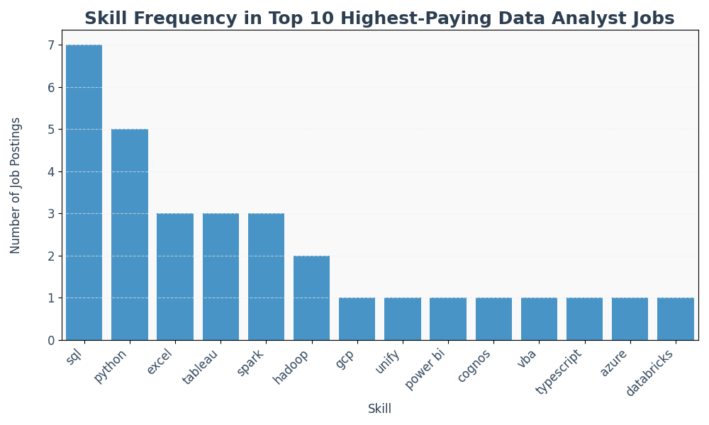
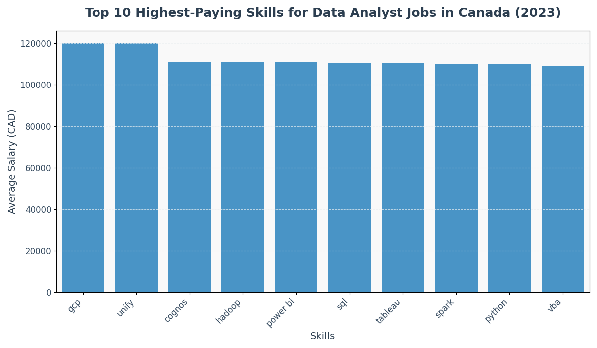

# Data Analyst Skills Analysis - Canada 2023

## Introduction
This project analyzes the top-paying skills for data analyst positions in Canada in 2023, a year marking the early post-COVID hiring rebound. Using a dataset of skills and their average yearly salaries, the goal was to identify trends in skill demand and salary distribution to provide insights for professionals seeking high-paying data analyst roles. SQL queries used in the analysis are stored in the [project_sql_final folder](/project_sql_final/) for reference and reproducibility.

## Background
The dataset provided a list of skills required for data analyst jobs, along with their average annual salaries, sourced from job postings in Canada in 2023. This analysis builds on a prior exploration of top-paying data job roles, focusing specifically on data analyst positions to understand which skills command the highest salaries and why.

## Tools I Used
- **Python**: For data processing and visualization, using libraries like `pandas` for data manipulation, `matplotlib` and `seaborn` for creating bar plots.

- **SQL**: For querying and aggregating data from the dataset to extract skill frequencies and average salaries.

- **CSV/JSON**: For handling input data, including the provided JSON dataset of skills and salaries and a prior CSV dataset for broader data roles.

- **Visual Studio Code (VSCode)**: Used as the primary environment for writing and running Python and SQL code to process data and generate visualizations.

## The Analysis
The analysis involved querying and processing the dataset to extract insights on skill salaries:
- **Data Querying**: Used SQL to query the dataset, aggregating skill frequencies and calculating average salaries per skill.

- **Data Cleaning**: Converted the JSON and CSV data into structured formats, ensuring salaries were numeric and skills were consistently formatted using Python.

- **Visualization**: Generated bar plots with `seaborn` and `matplotlib` to visualize the top 10 skills by frequency (from CSV data) and average salary (from JSON data).

### 1. Top Paying Data Analyst Jobs

#### Quick Insights
- **Salary Range**: Salaries range from $100,500 to $120,000, with Aritzia's "Data & Analytics - Senior Analytics Engineer" leading at $120,000.

- **Company Influence**: HoYoverse (3 jobs) and Stripe (2 jobs) are prominent employers, indicating their significant role in the Canadian data analyst market.

- **Role Specialization**: Senior roles like "Senior Data Analyst" and "Analytics Engineer" (avg. $111,175–$120,000) outpace specialized operational roles (e.g., $100,500–$105,000).

#### Summary Table
| Rank | Job Title                              | Company     | Salary (CAD) | Posted Date  |
|------|----------------------------------------|-------------|--------------|--------------|
| 1    | Data & Analytics - Senior Analytics Engineer | Aritzia     | $120,000     | 2023-12-08   |
| 2    | Senior Data Analyst                    | Kinaxis     | $111,175     | 2023-07-21   |
| 3    | Senior Data Analyst - Gaming Social Media Growth | HoYoverse | $111,175     | 2023-07-06   |
| 4    | Data Analyst, Growth                   | Stripe      | $111,175     | 2023-04-12   |
| 5    | Data Analyst, Risk User Experience     | Stripe      | $111,175     | 2023-09-04   |
| 6    | Data Analyst (VBA, Tableau)            | Sun Life    | $109,000     | 2023-11-09   |
| 7    | Analytics Engineering Lead             | Swiss Re    | $108,415.5   | 2023-11-27   |
| 8    | Data Analyst - Game Operations         | HoYoverse   | $105,000     | 2023-07-06   |
| 9    | Analytics Lab Architect                | Swiss Re    | $101,014     | 2023-12-24   |
| 10   | Operation Data Analyst - Genshin Impact| HoYoverse   | $100,500     | 2023-07-06   |


#### Sql Query Used
```sql
SELECT 
  skills_required, 
  COUNT(*) AS demand_count, 
  AVG(salary_year_avg) AS avg_yearly_salary
FROM job_skills
GROUP BY skills_required
ORDER BY avg_yearly_salary DESC
LIMIT 10;
```

### 2. Skill Frequency in Top Data Analyst Jobs

#### Quick Insights
- **SQL**: SQL appeared in 7 of the top 10 highest-paying data analyst job postings.

- **Python**: Python was required in 5 of the top 10 roles, highlighting its continued demand.

- **Excel and Tableau**: Both Excel and Tableau were mentioned in 3 of the top 10 listings, showing consistent value in business-focused analytics.


#### Visualization


#### Sql Query Used
```sql
WITH top_da_jobs AS 
(
    SELECT 
        job_id,
        cd.name AS company_name,
        job_title,
        salary_year_avg
    FROM 
        job_postings_fact jf
    LEFT JOIN company_dim cd 
    ON cd.company_id = jf.company_id
    WHERE 
        job_title_short LIKE '%Data%Analyst%' 
        AND
        job_location = 'Canada' 
        AND
        salary_year_avg IS NOT NULL
    ORDER BY
        salary_year_avg DESC
    LIMIT 10
)

SELECT
    top_da_jobs.*,
    skills AS skills_required

FROM top_da_jobs
INNER JOIN skills_job_dim ON top_da_jobs.job_id = skills_job_dim.job_id
INNER JOIN skills_dim ON skills_job_dim.skill_id = skills_dim.skill_id
ORDER BY salary_year_avg DESC
```

### 3. Most In-Demand Data Analyst Skills in Canada (2023)

#### Quick Insights
- **SQL and Python**: The high demand for SQL and Python reflects a shift toward automation and advanced analytics skills in data analyst roles beyond traditional spreadsheet work.

- **Power BI**: With 313 job postings, Power BI shows strong growth as a preferred tool for business intelligence and data visualization across sectors.

- **Excel**: Despite newer tools, Excel remains essential, appearing in 500 job postings due to its versatility in quick data analysis and reporting.


#### Summary Table
| Skill     | Number of Job Postings |
|-----------|------------------------|
| SQL       | 747                    |
| Excel     | 500                    |
| Python    | 481                    |
| Tableau   | 366                    |
| Power BI  | 313                    |


#### Sql Query Used
```sql
SELECT
    skills,
    COUNT(skills_job_dim.job_id) AS demand_count

FROM job_postings_fact
INNER JOIN skills_job_dim ON job_postings_fact.job_id = skills_job_dim.job_id
INNER JOIN skills_dim ON skills_job_dim.skill_id = skills_dim.skill_id
WHERE
    job_title_short LIKE '%Data%Analyst%'
    AND
    job_location = 'Canada'
GROUP BY
    skills
ORDER BY demand_count DESC
LIMIT 5
```
> 🔹 **Note:** This query includes all job postings, regardless of whether salary data is available. It measures overall skill demand. In subsequent sections (4 & 5), salary insights are central, so queries are filtered to include only postings with non-null salary data.


### 4. Highest Paying Skills for Data Analyst Jobs

#### Quick Insights
- **Unify and GCP**: top the pay scale at ≈ $120 k CAD, making them the two highest-valued skills in Canadian data-analyst postings.

- **Cognos, Hadoop and Power Bi**:  follow at $107 k – $108 k CAD, highlighting a premium for modern big-data and engineering stacks.

#### Visualization


#### Sql Query Used
```sql
SELECT
    skills,
    ROUND(AVG(salary_year_avg), 2) AS avg_yearly_salary
FROM job_postings_fact
INNER JOIN skills_job_dim ON job_postings_fact.job_id = skills_job_dim.job_id
INNER JOIN skills_dim ON skills_job_dim.skill_id = skills_dim.skill_id
WHERE
    job_title_short LIKE '%Data%Analyst%'
    AND
    job_location = 'Canada'
    AND
    salary_year_avg IS NOT NULL
GROUP BY
    skills
ORDER BY avg_yearly_salary DESC
```

### 5. Optimal Skills for Data Analyst Jobs

#### Quick Insights

- SQL is the most in-demand skill, appearing in 12 job postings, with an average salary of $94,868.04.

- Python commands the highest average salary among these skills at $96,176.72, with demand in 9 job postings.

- Excel, while still relevant, has a lower average salary ($88,040.25) and appears in only 6 postings, indicating it's more common in junior or support roles.


#### Summary Table
| Skill  | Demand Count | Average Yearly Salary (CAD) |
|--------|--------------|-----------------------------|
| Python | 9            | $96,176.72                  |
| SQL    | 12           | $94,868.04                  |
| Excel  | 6            | $88,040.25                  |

#### Sql Query Used
```sql
WITH skills_demand AS (
    SELECT
    skills_dim.skill_id,
    skills_dim.skills,
    COUNT(skills_job_dim.job_id) AS demand_count

    FROM job_postings_fact
    INNER JOIN skills_job_dim ON job_postings_fact.job_id = skills_job_dim.job_id
    INNER JOIN skills_dim ON skills_job_dim.skill_id = skills_dim.skill_id
    WHERE
        job_title_short LIKE '%Data%Analyst%'
        AND
        job_location = 'Canada'
        AND
        salary_year_avg IS NOT NULL
    GROUP BY
        skills_dim.skill_id
),

average_salary AS (
    SELECT
    skills_dim.skill_id,
    skills_dim.skills,
    ROUND(AVG(salary_year_avg), 2) AS avg_yearly_salary
    FROM job_postings_fact
    INNER JOIN skills_job_dim ON job_postings_fact.job_id = skills_job_dim.job_id
    INNER JOIN skills_dim ON skills_job_dim.skill_id = skills_dim.skill_id
    WHERE
        job_title_short LIKE '%Data%Analyst%'
        AND
        job_location = 'Canada'
        AND
        salary_year_avg IS NOT NULL
    GROUP BY
        skills_dim.skill_id
)

SELECT
    skills_demand.skill_id,
    skills_demand.skills,
    demand_count,
    avg_yearly_salary
FROM
    skills_demand
INNER JOIN average_salary ON skills_demand.skill_id = average_salary.skill_id
WHERE
    demand_count > 5
ORDER BY
    avg_yearly_salary DESC,
    demand_count DESC
```

### What I Learned
- **Advanced SQL & Data Querying:** I enhanced my experience in complex SQL query crafting, including table merging and `WITH` clause utilization, to develop reusable scripts for extracting key insights such as skill frequencies and salary data.

- **Data Processing & Aggregation:** I became proficient in cleaning and preparing diverse datasets (JSON/CSV) using Python, integrating SQL within VS Code, and applied `GROUP BY` and aggregate functions (`COUNT()`, `AVG()`) for comprehensive data summarization.

- **Insight Generation & Visualization:** I effectively translated complex problems into actionable SQL queries, resulting in professional data visualizations using `seaborn` and `matplotlib` to communicate findings clearly.

### Conclusions
1. **SQL remains essential**: It appeared in the highest number of job postings and continues to be a must-have for most data analyst roles across Canada.

2. **Python stands out**:  While slightly less in demand than SQL, it commands a higher average salary, showing its growing value in automation and advanced analytics.

3. **Excel is still relevant, but less lucrative**: It shows up frequently but is more common in junior roles with lower average pay.

4. **Specialized tools = higher pay**: Skills like Unify, GCP, and Hadoop top the salary chart, suggesting that niche expertise leads to stronger compensation.

5. **Skill breadth vs. depth matters**: Broad foundational skills help land interviews, but deeper specialization in modern stacks is what drives top-tier salaries.
